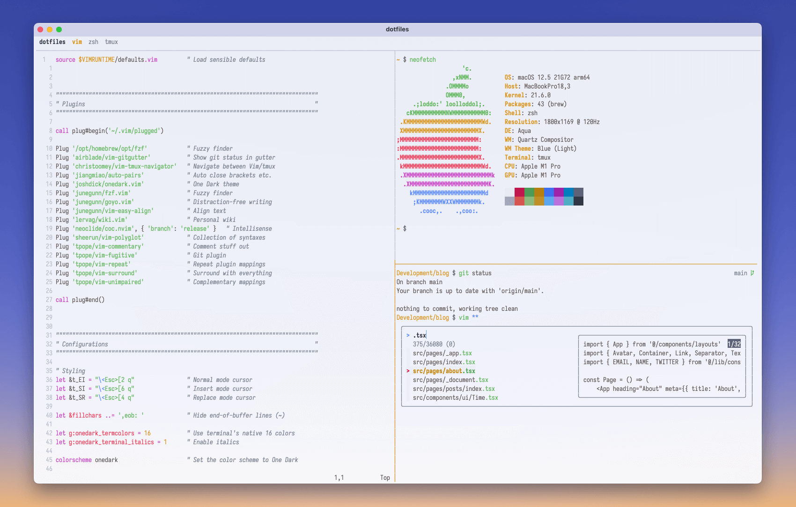
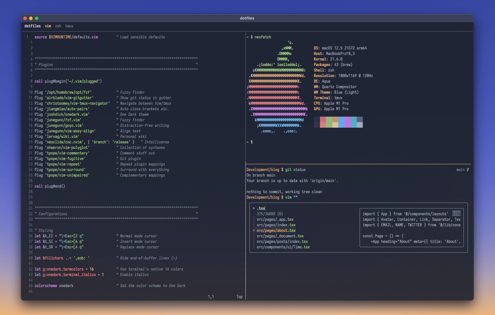

# Dotfiles

[](https://github.com/osinga/dotfiles/actions/workflows/test.yml)

My macOS dotfiles, set up as a [bare repository](https://www.atlassian.com/git/tutorials/dotfiles).

| Light Mode                           | Dark Mode                       |
|--------------------------------------|---------------------------------|
|  |  |

## Installation

1. Give Terminal full disk access ([why?](https://lapcatsoftware.com/articles/containers.html))
2. Download and execute the install script:

    ```sh
    curl https://raw.githubusercontent.com/osinga/dotfiles/main/src/install.sh | sh
    ```
